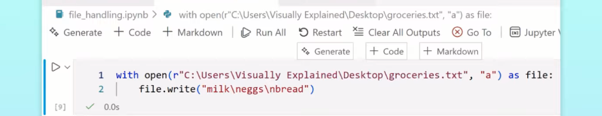

1. open()
2. with open() as f:
3. read()
4. write()
5. close()
6. repr()
7. split()
8. a,r,w
9. csv - pandas
10. json - json module - json.dump() and json.load()
11. pickle - pickle module
12. image - PIL module / openCV module

### For windows file path
